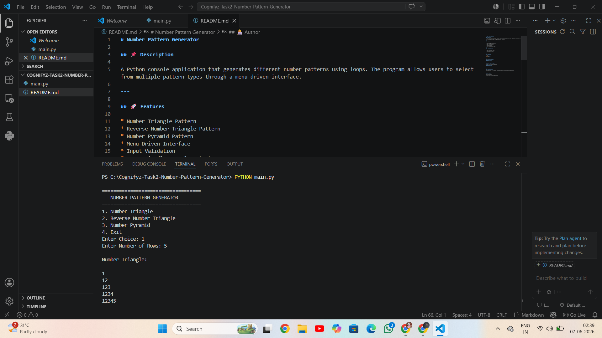
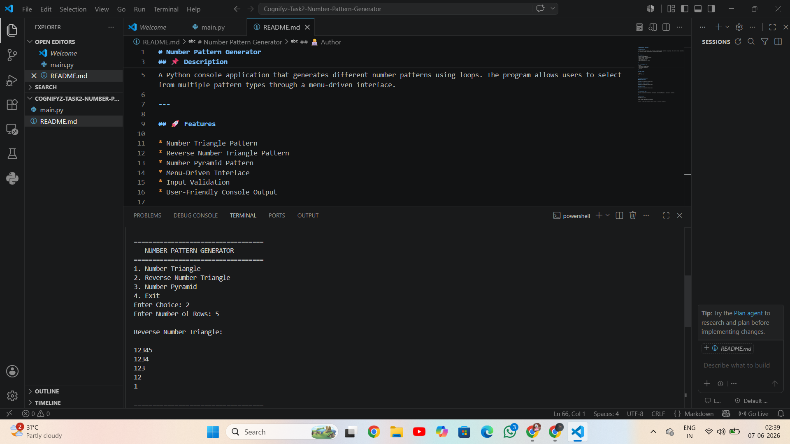
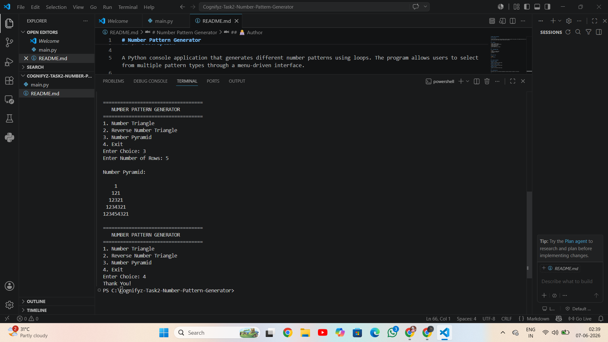

# Number Pattern Generator
## 📌 Description
A Python console application that generates different number patterns using loops. The program allows users to select from multiple pattern types through a menu-driven interface.
---
## 🚀 Features
* Number Triangle Pattern
* Reverse Number Triangle Pattern
* Number Pyramid Pattern
* Menu-Driven Interface
* Input Validation
* User-Friendly Console Output
---
## 🛠 Technologies Used
* Python
* Loops (for, nested loops)
* Conditional Statements
* Functions
---
## ▶️ How to Run
```bash
python main.py
```
---
## 📸 Output Screenshots
### Number Triangle


### Reverse Number Triangle


### Number Pyramid

---
## 🎯 Internship Task
Developed as part of the Software Development Internship Program at Cognifyz IT Solutions.
---
## 👩‍💻 Author
Shaik Rizwana Afrin

GitHub: https://github.com/Rizwana174

LinkedIn: https://www.linkedin.com/in/rizwana-afrin-shaik-9011a8291/
